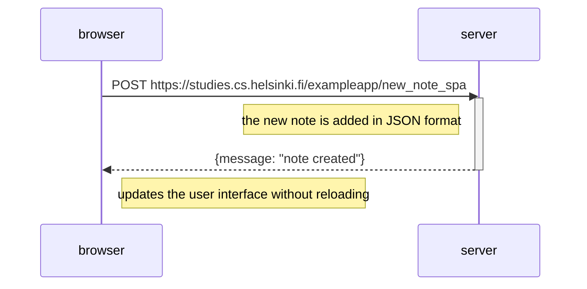

User creating a new note on https://studies.cs.helsinki.fi/exampleapp/spa

```mermaid
sequenceDiagram
    participant browser
    participant server

browser->>server: POST https://studies.cs.helsinki.fi/exampleapp/new_note_spa
activate server

Note left of server: the new note is added in JSON format

server-->>browser: {message: "note created"}
deactivate server

Note right of browser: updates the user interface without reloading
```